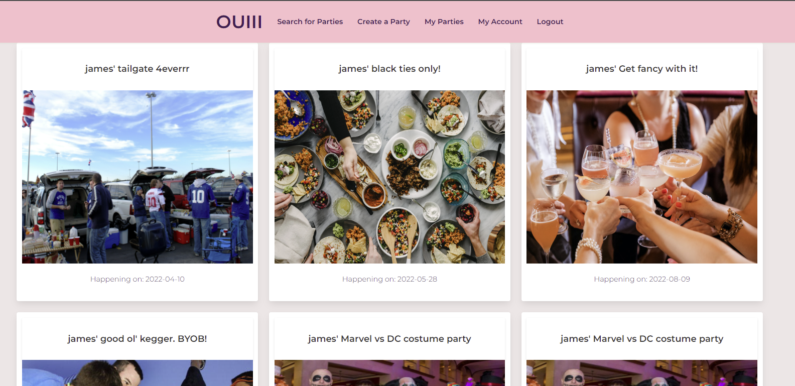

# OUiii

## License 

## Table of Contents
-[Description](#Description)  

-[Usage](#Usage)  

-[Contribution](#Contribution)   

-[URL](#URL)  

## Description
Social media application that allows a user to search for parties in their area as well as create parties which they can host.

### Programming Languages, Technologies/Frameworks
* HTML
* CSS
* Javascript ES6
* Node.js
* Express.js
* Sequelize ORM
* Heroku
* Bulma

## Usage
* Create a username and password on the signup page, or login if you already have a username and password. 
* In the search parties tab, filter your search by public/private parties, over 21, and theme.  
* Create a party from the tab on the dashboard as well as view what parties you have created in My Parties.  

## Contribution
true

### Snapshots

### URL of the deployed application (Heroku):
<https://ouiii-party.herokuapp.com/​.git>

### URL of the GitHub repository:
<https://github.com/jcomp-03/OUiii-1>
